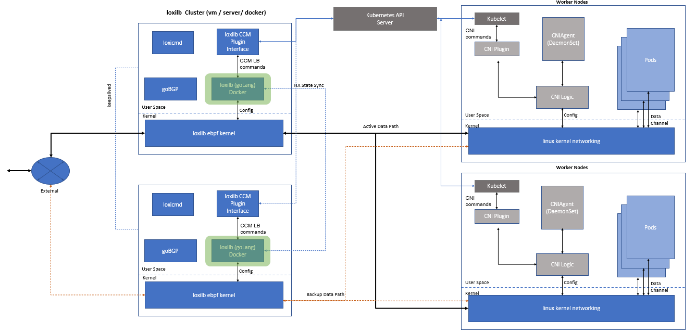

# loxilb architecture and modules

loxilb consists of the following modules :
- <b>loxilb CCM plugin</b>\
  It fully implements K8s CCM load-balancer interface and talks to goLang based loxilb process using Restful APIs. Although loxilb CCM is logically shown as part of loxilb cluster nodes, it will usually run in one of the worker/master nodes of the K8s cluster.
  
- <b>loxicmd</b>\
  loxicmd is command line tool  to configure and dump loxilb information which is based on same foundation as the wildly popular kubectl tools
  
- <b>loxilb</b>\
  loxilb is a modern goLang based framework (process) which mantains information coming in from various sources e.g apiserver and populates the eBPF maps used by the loxilb eBPF kernel. It is also responsible for loading eBPF programs to the interfaces.It also acts as a client to goBGP to exchange routes based on information from loxilb CCM. Last but not the least, it will be finally responsible for maintaining HA state sync with its remote peers. Almost all serious lb implementations need to be deployed as a HA cluster.
  
- <b>loxilb eBPF kernel</b>\
  eBPF kernel module implements the data-plane of loxilb which provides complete kernel bypass. It is a fully self contained and feature-rich stack able to process packets from rx to tx without invoking linux native kernel networking.
  
- <b>goBGP</b>\
  Although goBGP is a separate project, loxilb has adopted and integrated with goBGP as its routing stack of choice. We also hope to develop features for this awesome project in the future.

- <b>DashBoards</b>\
  Grafana based dashboards to provide highly dynamic insight into loxilb state.
  
The following is a typical loxilb deployment topology (Currently HA implementation is in development) : 

