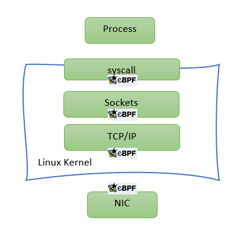
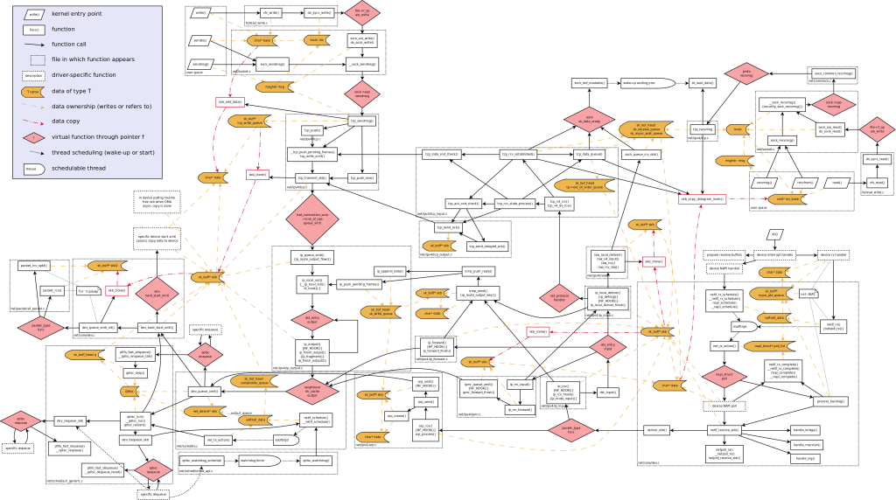

# What is eBPF ??

eBPF has been making quite some news lately.  An elegant way to extend the linux kernel (or windows)  has far reaching implications. Although initially, eBPF was used to enhance system observability beyond existing tools, we will explore in this post how eBPF can be used for enhancing Linux networking performance. 

## A quick recap

The hooks that are of particular interest for this discussion are NIC hook (invoked just after packet is received at NIC) and TC hook (invoked just before Linux starts processing packet with its TCP/IP stack).  Programs loaded to the former hook are also known as XDP programs and to the latter are called eBPF TC. Although both use eBPF restricted C syntax, there are significant differences between these types. (We will cover it in a separate blog later). For now, we just need to remember that when dealing with container-to-container or container-to-outside communication eBPF-TC makes much more sense since memory allocation (for skb) will happen either way in such scenarios.

## The performance bottlenecks

Coming back to the focus of our discussion which is of course performance, let us step back and take a look at why Linux sucks at networking performance (or rather why it could perform much faster). Linux networking evolved from the days of dial up modem networking when speed was not of utmost importance. Down the lane, code kept accumulating. Although it is extremely feature rich and RFC compliant, it hardly resembles a powerful data-path networking engine.  The following [figure](https://airtoncs.wordpress.com/2016/01/28/linux-kernel-flow-diagram/) shows a call-trace of Linux kernel networking stack:

The point is it has become incredibly complex over the years. Once features like NAT, VXLAN, conntrack etc come into play, Linux networking stops scaling due to cache degradation, lock contention etc.  

## One problem leads to the another 

To avoid performance penalties, many user-space frameworks like DPDK have been widely used, which completely skip the linux kernel networking and directly process packets in the user-space. As simple as that may sound, there are some serious drawbacks in using such frameworks e.g need to dedicate cores (can’t multitask), applications written on a specific user-space driver (PMD) might not run on another as it is, apps are also rendered incompatible across different DPDK releases frequently. Finally, there is a need to redo various parts of the TCP/IP stack and the provisioning involved. In short, it leads to a massive and completely unnecessary need of reinventing the wheel.  We will have a detailed post later to discuss these factors. But for now, in short, if we are looking to get more out of a box than doing only networking, DPDK is not the right choice. In the age of distributed edge computing and immersive metaverse, the need to do more out of less is of utmost importance. 

## eBPF comes to the rescue

Now, eBPF changes all of this. eBPF is hosted inside the kernel so the biggest advantage of eBPF is it can co-exist with Linux/OS without the need of using dedicated cores, skipping the Kernel stack or breaking tools used for ages by the community. Handling of new protocols and functionality can be done in the fly without waiting for kernel development to catch up.

