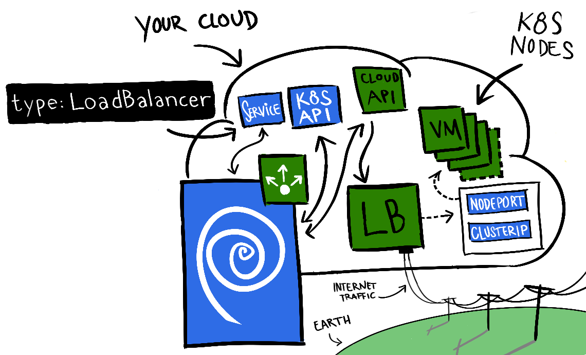

# What is service type external load-balancer in Kubernetes ?


There are many different types of services like NodePort, ClusterIP etc. However, service type external load-balancer provides a way of exposing your application internally and/or externally in the perspective of the k8s cluster. Usually, Kubernetes CCM provider ensures that a load balancer of some sort is created, deleted and updated in your cloud. For on-prem or edge deployments however, organziations need to provide their own CCM load-balancer functions. MetalLB has been the choice for such cases for long. 



But edge services need to support so many exotic protocols in play like GTP, SCTP, SRv6 etc and integrating everything into a seamlessly working solution has been quite difficult. This is an area where loxilb aims to play a pivotal role.

The following is a simple yaml config file which needs to be applied to create a service type load-balancer :

```
 "type": "LoadBalancer"
 {
      "kind": "Service",
      "apiVersion": "v1",
      "metadata": {
        "name": "sample-service"
      },
      "spec": {
        "ports": [{
          "port": 9001,
          "targetPort": 5001
        }],
        "selector": {
          "app": "sample"
        },
        "type": "LoadBalancer"
      }
    }
```
 
However, if there is no K8s CCM plugin implementing external service load-balancer, such services won't be created and remain in pending state forever.
