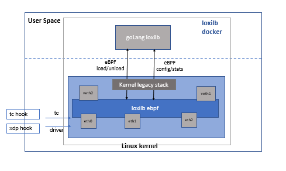
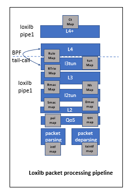

# loxilb eBPF implementation details

In this section, we will look into details of loxilb ebpf implementation in little details and try to check what goes on under the hood. When loxilb is build, it builds two object files as follows :

```
llb@nd2:~/loxilb$ ls -l /opt/loxilb/
total 396
drwxrwxrwt 3 root root    0  6?? 20 11:17 dp
-rw-rw-r-- 1 llb llb 305536  6?? 29 09:39 llb_ebpf_main.o
-rw-rw-r-- 1 llb llb  95192  6?? 29 09:39 llb_xdp_main.o
```

As the name suggests and based on hook point, *xdp* version does XDP packet processing while *ebpf* version is used at TC layer for TC eBPF processing. Interesting enough, the packet forwarding code is largely agnostic of its final hook point due to usage of a light abstraction layer to hide differences between eBPF and XDP layer.

Now this beckons the question why separate hook points and how does it all work together ? loxilb does bulk of its processing at TC eBPF layer as this layer is most optimized for doing L4+ processing needed for loxilb operation. XDP's frame format is different than what is used by skb (linux kernel's generic socket buffer). This makes it very difficult (if not impossible) to do tcp checksum offload and other such features used by linux networking stack for quite some time now. In short, if we need to do such operations, XDP performance will be inherently slow. XDP as such is perfect for quick operations at l2 layer. loxilb uses XDP to do certain operations like mirroring. Due to how TC eBPF works, it is difficult to work with multiple packet copies and loxilb's TC eBPF offloads some functinality to XDP layer in such special cases.



## Loading of loxilb eBPF program

loxilb's goLang based agent by default loads the loxilb ebpf programs in all the interfaces(only physical/real/bond/wireguard) available in the system. As loxilb is designed to run in its own docker/container, this is convenient for users who dont want to have to manually load/unload eBPF programs. However, it is still possible to do so manually if need arises :

To load :
```
ntc filter add dev eth1 ingress bpf da obj /opt/loxilb/llb_ebpf_main.o sec tc_packet_parser
```

To unload:
```
ntc filter del dev eth1 ingress
```

To check:
```
root@nd2:/home/llb# ntc filter show dev hs2 ingress
filter protocol all pref 49152 bpf chain 0 
filter protocol all pref 49152 bpf chain 0 handle 0x1 llb_ebpf_main.o:[tc_packet_parser] direct-action not_in_hw id 8715 tag 43a829222e969bce jited 
```

*Please not that <b>ntc</b> is the customized tc tool from iproute2 package which can be found in loxilb's repository*

## Entry points of loxilb eBPF

loxilb's eBPF code is usually divided into two program sections with the following entry functions :

- tc_packet_func\
  This alongwith the consequent code does majority of the packet processing. If conntrack entries are in established state, this is also responsible for packet tx. However if conntrack entry for a particular packet flow is not established, it makes a bpf tail call to the *tc_packet_func_slow*
  
- tc_packet_func_slow\
  This is responsible mainly for doing NAT lookup and stateful conntrack implementation. Once conntrack entry transitions to established state, the forwarding then can happen directly from tc_packet_func
  
loxilb's XDP code is contained in the following section :

- xdp_packet_func\
  This is the entry point for packet processing when hook point is XDP instead of TC eBPF
  
  
## Pinned Maps of loxilb eBPF
  
All maps used by loxilb eBPF are mounted in the file-system as below :

```
root@nd2:/home/llb/loxilb# ls -lart /opt/loxilb/dp/
total 4
drwxrwxrwt 3 root root    0  6?? 20 11:17 .
drwxr-xr-x 3 root root 4096  6?? 29 10:19 ..
drwx------ 3 root root    0  6?? 29 10:19 bpf
root@nd2:/home/llb/loxilb# mount | grep bpf
none on /opt/netlox/loxilb type bpf (rw,relatime)

root@nd2:/home/llb/loxilb# ls -lart /opt/loxilb/dp/bpf/
total 0
drwxrwxrwt 3 root root 0  6?? 20 11:17 ..
lrwxrwxrwx 1 root root 0  6?? 20 11:17 xdp -> /opt/loxilb/dp/bpf//tc/
drwx------ 3 root root 0  6?? 20 11:17 tc
lrwxrwxrwx 1 root root 0  6?? 20 11:17 ip -> /opt/loxilb/dp/bpf//tc/
-rw------- 1 root root 0  6?? 29 10:19 xfis
-rw------- 1 root root 0  6?? 29 10:19 xfck
-rw------- 1 root root 0  6?? 29 10:19 xctk
-rw------- 1 root root 0  6?? 29 10:19 tx_intf_stats_map
-rw------- 1 root root 0  6?? 29 10:19 tx_intf_map
-rw------- 1 root root 0  6?? 29 10:19 tx_bd_stats_map
-rw------- 1 root root 0  6?? 29 10:19 tmac_stats_map
-rw------- 1 root root 0  6?? 29 10:19 tmac_map
-rw------- 1 root root 0  6?? 29 10:19 smac_map
-rw------- 1 root root 0  6?? 29 10:19 rt_v6_stats_map
-rw------- 1 root root 0  6?? 29 10:19 rt_v4_stats_map
-rw------- 1 root root 0  6?? 29 10:19 rt_v4_map
-rw------- 1 root root 0  6?? 29 10:19 polx_map
-rw------- 1 root root 0  6?? 29 10:19 pkts
-rw------- 1 root root 0  6?? 29 10:19 pkt_ring
-rw------- 1 root root 0  6?? 29 10:19 pgm_tbl
-rw------- 1 root root 0  6?? 29 10:19 nh_map
-rw------- 1 root root 0  6?? 29 10:19 nat_v4_map
-rw------- 1 root root 0  6?? 29 10:19 mirr_map
-rw------- 1 root root 0  6?? 29 10:19 intf_stats_map
-rw------- 1 root root 0  6?? 29 10:19 intf_map
-rw------- 1 root root 0  6?? 29 10:19 fc_v4_stats_map
-rw------- 1 root root 0  6?? 29 10:19 fc_v4_map
-rw------- 1 root root 0  6?? 29 10:19 fcas
-rw------- 1 root root 0  6?? 29 10:19 dmac_map
-rw------- 1 root root 0  6?? 29 10:19 ct_v4_map
-rw------- 1 root root 0  6?? 29 10:19 bd_stats_map
-rw------- 1 root root 0  6?? 29 10:19 acl_v6_stats_map
-rw------- 1 root root 0  6?? 29 10:19 acl_v4_stats_map
-rw------- 1 root root 0  6?? 29 10:19 acl_v4_map
```

Using bpftool, it is easy to check state of these maps as follows :

```
root@nd2:/home/llb# bpftool map dump pinned /opt/loxilb/dp/bpf/intf_map 
[{
        "key": {
            "ifindex": 2,
            "ing_vid": 0,
            "pad": 0
        },
        "value": {
            "ca": {
                "act_type": 11,
                "ftrap": 0,
                "oif": 0,
                "cidx": 0
            },
            "": {
                "set_ifi": {
                    "xdp_ifidx": 1,
                    "zone": 0,
                    "bd": 3801,
                    "mirr": 0,
                    "polid": 0,
                    "r": [0,0,0,0,0,0
                    ]
                }
            }
        }
    },{
        "key": {
            "ifindex": 3,
            "ing_vid": 0,
            "pad": 0
        },
        "value": {
            "ca": {
                "act_type": 11,
                "ftrap": 0,
                "oif": 0,
                "cidx": 0
            },
            "": {
                "set_ifi": {
                    "xdp_ifidx": 3,
                    "zone": 0,
                    "bd": 3803,
                    "mirr": 0,
                    "polid": 0,
                    "r": [0,0,0,0,0,0
                    ]
                }
            }
        }
    }
]
```

As our development progresses, we will keep updating details about these map's internals


## loxilb eBPF pipeline at a glance

The following figure shows a very high-level diagram of packet flow through loxilb  eBPF pipeline :



We use eBPF tail calls to jump from one section to another majorly due to the fact that there is clear separation for CT (conntrack) functionality and packet-forwarding logic. At the same time, kernel's built in eBPF-verifier imposes a maximum code size limit for a single program.


